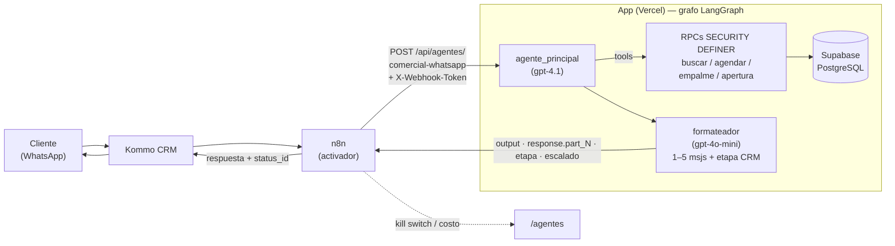

# Cumbres State Inventory

Plataforma de gestión inmobiliaria de **Cumbres Inmobiliaria** (Medellín / Bello): catálogo de inmuebles sincronizado con el ERP, agenda de visitas, captación de propiedades, firma biométrica de contratos y un **sistema de tres agentes de IA** que atienden clientes por WhatsApp, responden inteligencia de negocio y descubren propiedades de dueño directo.

> **Stack:** Next.js 16.2.6 (App Router + Turbopack) · React 19 · TypeScript · Supabase (PostgreSQL + RLS + Auth + Storage) · LangGraph / LangChain · OpenAI + Anthropic · n8n · Vercel · ERP ArrendaSoft/Nuby.

---

## 📑 Contenido

- [Qué es](#-qué-es)
- [Funcionalidades](#-funcionalidades)
- [El sistema agéntico](#-el-sistema-agéntico)
- [Flujo del agente comercial](#-flujo-del-agente-comercial)
- [Evolución de la arquitectura](#-evolución-de-la-arquitectura)
- [Concepto clave: el estado de un inmueble](#-concepto-clave-el-estado-de-un-inmueble)
- [Estructura del proyecto](#-estructura-del-proyecto)
- [Desarrollo local](#-desarrollo-local)
- [Deploy y migraciones](#-deploy-y-migraciones)
- [Documentación](#-documentación)

---

## 🎯 Qué es

Una sola aplicación web (multi-tenant por inmobiliaria) que reemplaza una operación dispersa entre el ERP, hojas de cálculo y chats. Cubre el ciclo completo: **captar** una propiedad → **publicarla** → **agendarla** para visita → **firmar** el contrato, con automatización en los puntos donde antes había trabajo manual.

- **Frontend:** Next.js App Router — Server Components + islas cliente, Server Actions (`'use server'`) para procesar formularios y llamar APIs externas sin exponer secretos.
- **Backend:** Supabase (PostgreSQL con RLS, Auth, Storage, PostgREST). Reglas de negocio en funciones SQL `SECURITY DEFINER`.
- **Automatización:** n8n (self-hosted) para flujos de salida (captación → Drive/Docs/Facebook + creación en el ERP, confirmación de citas hacia el CRM Kommo) y como **activador** del agente comercial.
- **IA:** grafos LangGraph que corren **dentro del repo** (no en n8n), con modelos de OpenAI y Anthropic.

---

## 🧩 Funcionalidades

Todos los módulos están **en producción** salvo donde se indique.

| Módulo | Ruta | Qué hace |
|---|---|---|
| **Dashboard** | `/dashboard` | Resumen operativo; widget de aprobaciones para admins. |
| **Inmuebles** | `/inmuebles` | Catálogo estilo *feed* (la foto manda). Filtros por tipo/transacción/estado/asesor. Panel "Gestionar" (estado, asesor, unidad, ofertar, empalme). |
| **Sync ERP** | `/inmuebles/sync` | Importa/actualiza el catálogo desde ArrendaSoft/Nuby; reconcilia bajas (inactivos), agrupa por unidad (URB./CONJ./EDIF.), enlaza asesores. |
| **Captación** | `/inmuebles?action=captar` | Formulario que registra una propiedad: sube las fotos a Storage y dispara el webhook n8n. Barrio/Municipio/Asesor son selectores que envían el **id del ERP**. |
| **Captaciones (CRM)** | `/captaciones` | Bandeja de prospectos de dueño directo (FSBO) que alimenta el agente de captaciones. |
| **Inventarios** | `/inventarios` | Ficha técnica del inmueble e inventario de entrega/recibo, con impresión. |
| **Agenda** | `/agenda` | Franjas horarias de disponibilidad por asesor. |
| **Citas** | `/citas` | Visitas agendadas (por el agente o a mano). Admin: confirmar (→ Kommo) / cancelar / aprobar solicitudes de apertura. **Asesor:** marcar cada visita como *realizada*. |
| **Tareas** | `/tareas` | Cola de trabajo operativa; muchas se generan solas (captación, cita agendada, solicitud de apertura, empalme…). |
| **Asesores** | `/asesores` | Gestión del equipo comercial. |
| **Arriendabot (BI)** | `/inteligencia` | Chat de inteligencia de negocio (solo admins). Ver abajo. |
| **Agentes** | `/agentes` | Administración de los agentes de IA: encender/pausar (kill switch), gasto mensual por agente, y edición **en caliente** del prompt del agente comercial. |
| **Firma biométrica** | (en el flujo de contrato) | Firma manuscrita, foto facial y escaneo de cédula in-app. Reemplazó por completo a ZapSign. |

---

## 🤖 El sistema agéntico

Tres agentes, todos **in-app** (corren en este repo, no en n8n), cada uno con su propósito, sus modelos y su tablero de control en `/agentes`.

### 1. Arriendabot — Asesor BI (`/inteligencia`)

Chat de inteligencia comercial para admins. Grafo LangGraph (`createReactAgent`) con **Claude (Sonnet 5 por defecto**, `BI_MODEL` lo cambia) y herramientas de **solo lectura**:

- `consultar_base_datos` — `SELECT` sobre la base de la app con el rol `bi_reader` (citas, agenda, inventario, captaciones, tareas).
- `consultar_erp` — API pública de Nuby (propiedades, contratos, **facturas/cartera**, asesores). Los endpoints de escritura del ERP no se exponen.

Persiste las conversaciones y guarda *informes/briefs* para consultarlos después. Streaming NDJSON en `app/api/inteligencia/route.ts`.

### 2. Agente Comercial WhatsApp (LangGraph)

Atiende clientes por WhatsApp: busca inmuebles, agenda visitas y maneja empalmes. **Migrado de n8n a un grafo LangGraph in-app el 17 jul 2026**; desde entonces atiende tráfico real (>200 conversaciones).

- **Endpoint:** `POST /api/agentes/comercial-whatsapp` (Header Auth `X-Webhook-Token`). Escribe con el cliente admin (service role): el llamador confiable es n8n vía token.
- **Grafo** (`lib/agente-comercial/graph.ts`): dos nodos — `agente_principal` (**gpt-4.1**, `createReactAgent`) → `formateador` (**gpt-4o-mini**: parte la respuesta en 1–5 mensajes de WhatsApp y clasifica la etapa CRM). Sin vuelta atrás: si el formateador falla se manda el borrador crudo, nunca se re-corre el agente (re-ejecutaría tools con efecto).
- **Herramientas** (`lib/agente-comercial/tools.ts`): `buscar_inmuebles`, `buscar_inmueble_por_codigo`, `verificar_horarios_disponibles`, `agendar_cita`, `solicitar_apertura_de_agenda`, `cancelar_cita`, `compartir_contacto_empalme`, `obtener_fotos` (galería pública `/f/[codigo]`), `google_maps_lugares`. Llaman RPCs `SECURITY DEFINER` — el contrato de datos no se rompe, solo cambió el llamador.
- **Grounding:** bloquea precios sin respaldo, escala con `[ESCALAR]`, candado de idempotencia al agendar, kill switch temprano (antes de gastar tokens).

### 3. Agente de Captaciones (Mercado Libre + Facebook)

Toma anuncios de **dueño directo (FSBO)**, los **califica**, **redacta** el primer mensaje al propietario y alimenta el CRM de prospectos (`/captaciones`). Es *upstream* de la captación: descubre propiedades para captar. Foco: arriendos en Bello y Robledo.

- **Descubrimiento:** correo de alerta (Mercado Libre y portales, vía n8n → `intake-email`) **autónomo**, o el **bookmarklet "Captar"** (1 clic del asesor, la única vía para Facebook porque Meta no manda alertas).
- **Grafo** (`lib/agente-captaciones/graph.ts`): `normalizar → calificar → deduplicar → redactar → persistir`. Modelos OpenAI (`gpt-4.1-mini` califica, `gpt-4.1` redacta). CRM en Supabase (`captacion_prospectos`), no Kommo.
- **Humano en el bucle:** el agente descubre/califica/redacta, pero **el envío lo aprueba y ejecuta una persona** — nunca escribe a un propietario por su cuenta.

### Administración (`/agentes`)

Cada agente se **enciende/pausa** desde la UI (kill switch, re-chequeado del lado Postgres como defensa en profundidad) y expone su **gasto mensual en USD**. El prompt del agente comercial vive en `agentes_config.prompt_sistema` y se edita **en caliente**, sin redeploy.

---

## 🔄 Flujo del agente comercial



n8n **activa** al agente (recibe de Kommo, llama al endpoint, escribe la respuesta de vuelta a Kommo), pero **el razonamiento vive en el repo**. El contrato de respuesta (`output`, `response.part_N`, `etapa`, `escalado`) es lo que n8n consume y **no se debe romper**.

---

## 🏗️ Evolución de la arquitectura

El proyecto empezó como un MVP y fue endureciéndose hacia patrones deliberados:

- **Razonamiento IA: de n8n al repo.** El agente comercial *razonaba* en n8n (nodo LangChain). Se **migró a un grafo LangGraph in-app** (jul 2026) para tener el prompt, las tools y el control de versiones dentro del código; n8n quedó como activador. Los agentes de BI y de captaciones nacieron ya en LangGraph.
- **Firma digital: de ZapSign a in-app.** Se eliminó ZapSign por completo y se construyó un **sistema biométrico propio** (firma manuscrita, foto facial, escaneo de cédula) con URLs firmadas desde Server Actions.
- **Soberanía local del estado.** Se introdujo `estado_override` para que la app pueda **ofertar** un inmueble ocupado o marcarlo en **empalme** sin que el sync del ERP pise esa decisión (ver abajo).
- **Fotos de captación: fuera de la función serverless.** El formulario subía las fotos por el Server Action y chocaba con el tope de ~4.5 MB de Vercel → ahora el navegador las sube **directo a Supabase Storage** y al webhook solo viajan las URLs.
- **Datos que viajan por id, no por nombre.** Barrio, Municipio y Asesor en la captación se volvieron selectores que envían el **id del ERP** (`Barrio_id`, `Asesor_id`), para que n8n asigne en Nuby sin emparejar por texto.
- **Escrituras controladas por rol.** Donde la RLS es restrictiva (p. ej. asesores con solo lectura sobre citas), las escrituras van por RPCs `SECURITY DEFINER` con verificación de dueño, en vez de abrir políticas de UPDATE amplias.

---

## 🔑 Concepto clave: el estado de un inmueble

Un inmueble tiene **tres** campos de estado con roles distintos, y una invariante:

```
estado = coalesce(estado_override, estado_erp)
```

- **`estado_erp`** — lo crudo del ERP (`disponible` / `arrendado` / `inactivo`). Solo lo escribe el sync.
- **`estado_override`** — la decisión **local** que el sync nunca pisa: `disponible` (ofertar un desocupado que el ERP aún tiene arrendado) o `empalme` (ocupado que muestra el inquilino de salida, con su teléfono de contacto).
- **`estado`** — el **efectivo**: lo que filtran la app y los agentes.

El **empalme** es un buen ejemplo de cómo se cruzan los módulos: se marca en `/inmuebles`, no crea agenda, y el agente comercial **comparte el teléfono del inquilino** (solo tras calificar al lead) en vez de agendar.

---

## 📁 Estructura del proyecto

```
app/
  (dashboard)/          → módulos con layout autenticado (inmuebles, citas, agentes, …)
  api/
    agentes/comercial-whatsapp/   → endpoint del agente comercial (LangGraph)
    agentes/captaciones/          → intake por correo y por lote (bookmarklet)
    inteligencia/                 → chat BI (streaming NDJSON)
    integraciones/mercadolibre/   → OAuth de Mercado Libre
  actions/              → Server Actions (inmuebles, agenda, webhook-n8n, sync-nuby, biometria, solicitudes, agentes…)
lib/
  agente-comercial/     → grafo, tools, prompt (DB), costos del agente de WhatsApp
  agente-captaciones/   → grafo de prospectos + fuentes (Mercado Libre, FB)
  bi/                   → agente BI (db, erp, prompt, costos)
  captacion/            → catálogos (barrios, asesores) del formulario
  nuby.ts               → cliente del ERP ArrendaSoft/Nuby
  supabase/             → clientes server / browser / admin
supabase/migrations/    → migraciones SQL (se aplican a mano en el SQL Editor)
```

---

## 💻 Desarrollo local

Requisitos: Node 20+, un proyecto Supabase y credenciales del ERP Nuby.

```bash
npm install
npm run dev
```

Abre [http://localhost:3000](http://localhost:3000).

> ⚠️ **Next.js 16 tiene breaking changes** respecto a versiones anteriores (APIs, convenciones, estructura). Antes de escribir código, consulta la guía correspondiente en `node_modules/next/dist/docs/` (ver `AGENTS.md`).

### Variables de entorno (`.env.local`)

| Categoría | Variables |
|---|---|
| Supabase | `NEXT_PUBLIC_SUPABASE_URL`, `NEXT_PUBLIC_SUPABASE_ANON_KEY`, `SUPABASE_SERVICE_ROLE_KEY` |
| ERP Nuby | `NUBY_API_INSTANCIA`, `NUBY_CLIENT_ID`, `NUBY_CLIENT_SECRET` |
| IA | `OPENAI_API_KEY`, `BI_MODEL` (opcional), `AGENTE_COMERCIAL_MODELO*` (opcional) |
| n8n | `N8N_WEBHOOK_URL` (captación), `N8N_AGENTE_COMERCIAL_TOKEN`, `N8N_APERTURA_VEREDICTO_*` |
| Mercado Libre | `ML_CLIENT_ID`, `ML_CLIENT_SECRET` |
| Otros | `GOOGLE_MAPS_API_KEY`, `CUMBRES_INMOBILIARIA_ID`, `LANGSMITH_*` (traza), `PDFSHIFT_API_KEY` |

---

## 🚀 Deploy y migraciones

- **Hosting:** Vercel, deploy automático desde `main`. Las env vars se replican en el panel de Vercel.
- **Migraciones:** los archivos de `supabase/migrations/` se aplican **a mano en el SQL Editor de Supabase** *antes* de desplegar el código que las consume — si no, los `select` a columnas inexistentes se ven como vistas vacías.

---

## 📚 Documentación

La documentación viva vive en el vault de Obsidian (`Proyectos/Cumbres State Inventory`): arquitectura, modelo de datos, integración con el ERP, agenda/citas y una nota por cada agente. El README resume; el vault detalla.
